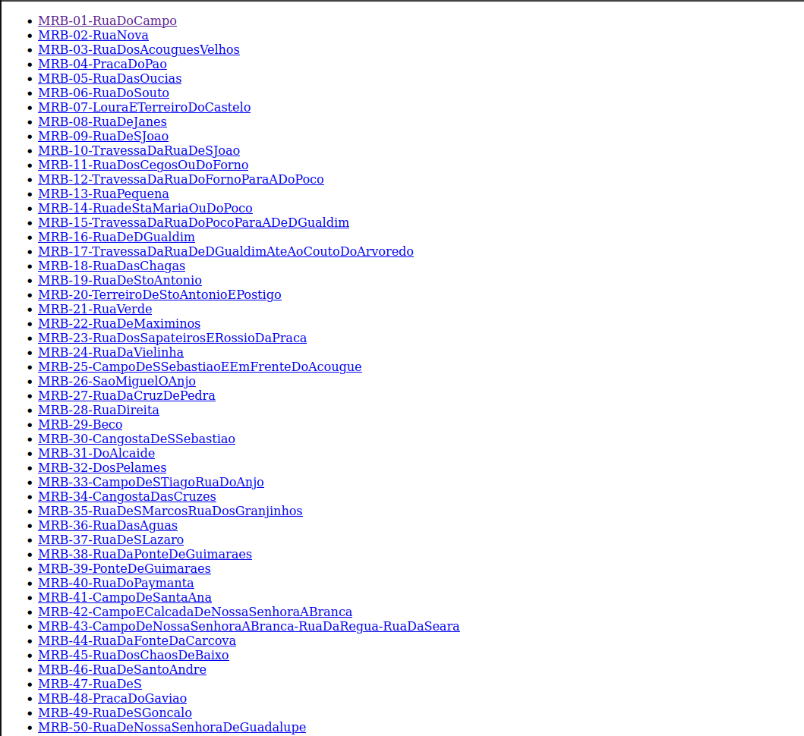
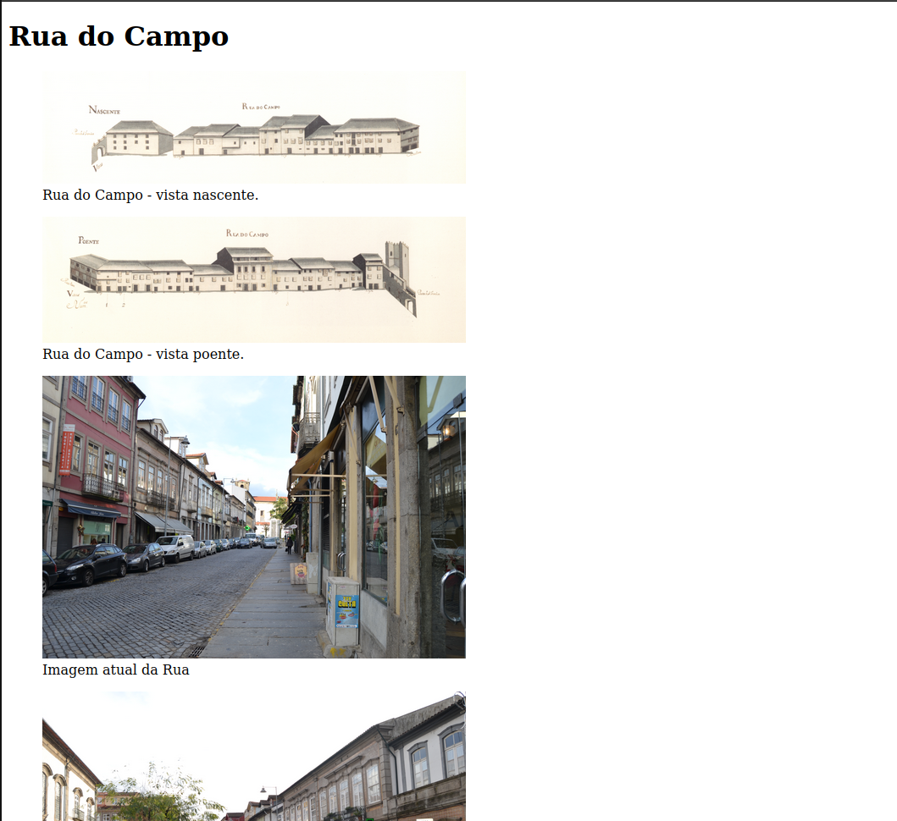
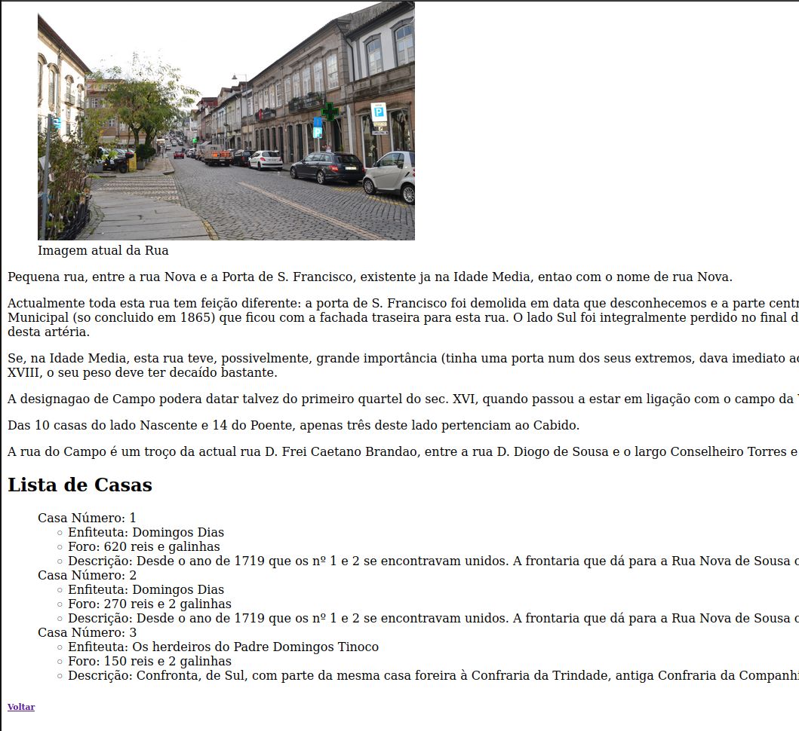

# TPC1

## Aluno

Nome: João Carvalho

Numero: A94015

## Objetivo

Fazer uma página HTML com um índice com as ruas fornecidas, sendo que cada rua possui um link para outra página HTML onde tem informações sobre a mesma. As informações são obtidas através da leitura dos ficheiros .xml de cada rua.

## Resultados

**Pagina inicial com o index:** 

**Parte da pagina de uma das ruas:** 

**Resto da pagina:** 