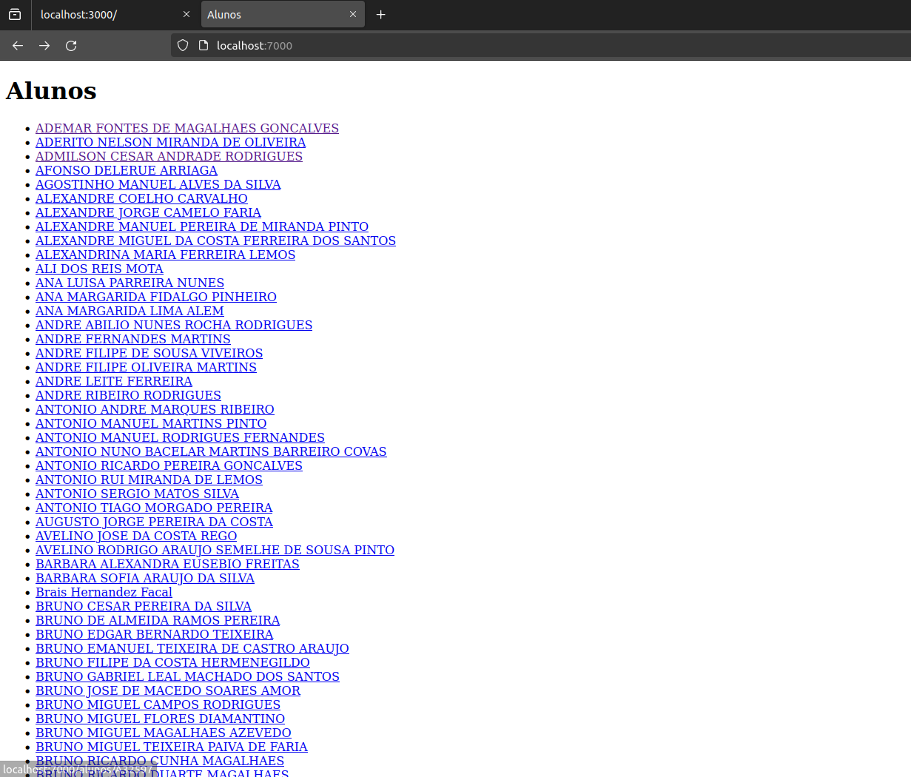
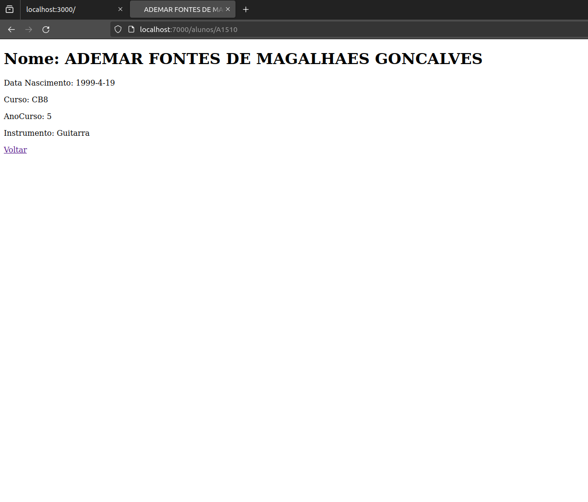

# TPC2

## Aluno

Nome: João Carvalho

Numero: A94015

## Objetivo

Fazer um servidor em Node.js que vai buscar dados a um JSON Server fornecido e apresenta uma lista de alunos ordenada alfabeticamente, sendo que, clicando no link  presente no nome de cada um desses alunos, somos redirecionados para uma página onde temos toda a sua informação numa página web.

## Resultados

**Pagina inicial com o index:** 

**Pagina de um aluno:** 
